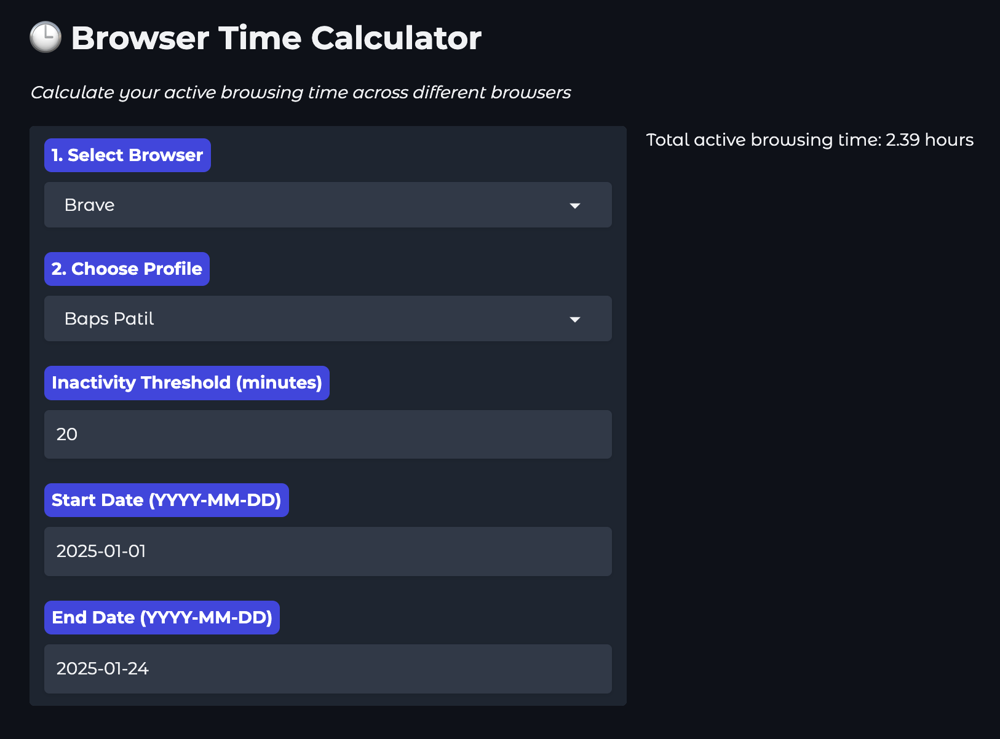

# Browser Time Calculator ⏳

A really, really simple tool to calculate how many hours you've spent in a browser using the time difference between browser history items, a.k.a. the Inactivity Threshold.

I did this to roughly calculate time spent on a client who has a monthly retainer with me.



## Before You Begin
To check your usage in Chrome, you'll need to use another browser, say Brave to check your Chrome usage. You'll also need to quit Chrome completely. At the moment, you can't check your browser time for a browser that's currently in use.

### What is the Inactivity Threshold?
If the time gap between two browser history items, a.k.a. the Inactivity Threshold, is more than 20 minutes, the time between those two browser history items isn't counted.

## Installation & Usage

Create a virtual environment named .venv
```uv venv .venv```


Activate the environment

On Windows:
```.\.venv\Scripts\activate```

On macOS/Linux:
```source .venv/bin/activate```


Install Gradio
```uv pip install gradio```

Run the app!
```python3 calculate_browser_hours.py```

## Supported Browsers

- Google Chrome
- Brave
- Arc

### Upcoming Support

- Safari
- Firefox